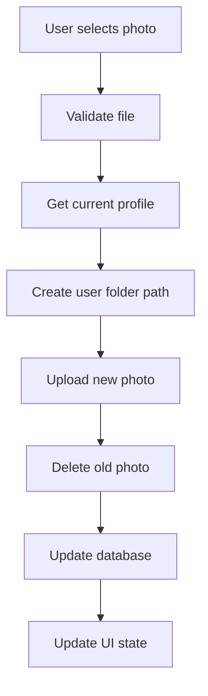

# Photo Profile System V2 - Folder Structure & Auto-Cleanup

Sistem photo profile yang telah dirombak dengan struktur folder yang terorganisir dan auto-cleanup foto lama.

## 🏗️ Struktur Folder Baru

### Supabase Storage Structure
```
profile-photos/
├── users/
│   ├── {user-uuid-1}/
│   │   └── profile_1672531200000.jpg
│   ├── {user-uuid-2}/
│   │   └── profile_1672531300000.webp
│   └── {user-uuid-3}/
│       └── profile_1672531400000.png
```

### Keuntungan Struktur Baru
- **Organized**: Setiap user memiliki folder sendiri berdasarkan UUID
- **Scalable**: Mudah dikelola saat ribuan user
- **Clean**: Foto lama otomatis terhapus
- **Unique**: Menggunakan UUID user sebagai nama folder
- **Timestamped**: Nama file menggunakan timestamp untuk uniqueness

## 🚀 Fitur Sistem Baru

### 1. **Auto-Delete Old Photos**
- Foto profile lama otomatis terhapus saat upload foto baru
- Mencegah penumpukan file di storage
- Menjaga efisiensi storage space

### 2. **User-Specific Folders**
- Setiap user memiliki folder unik: `users/{user-uuid}/`
- Mudah tracking dan maintenance per user
- Isolated storage per user

### 3. **Enhanced File Handling**
```typescript
// Struktur nama file baru
const newFileName = `profile_${timestamp}.${fileExt}`;
const filePath = `users/${user.id}/${newFileName}`;
```

### 4. **Improved Error Handling**
- Rollback upload jika database update gagal
- Cleanup file jika ada error
- Comprehensive logging untuk debugging

### 5. **Delete Photo Feature**
- Tombol delete foto profile di account page
- Clean deletion dari storage dan database
- Real-time UI update

## 📝 API Changes

### New Functions

#### `deleteOldProfilePhoto(oldPhotoUrl: string)`
```typescript
// Menghapus foto lama dari storage
const result = await deleteOldProfilePhoto(currentProfile.profile_photo_url);
```

#### `uploadProfilePhotoBase64(uploadData)` - Enhanced
```typescript
// Response baru dengan info delete status
{
  success: boolean;
  message: string;
  url?: string;
  oldPhotoDeleted?: boolean; // New field
}
```

#### `deleteUserProfilePhoto()` - New
```typescript
// Hapus foto profile user dan clear dari database
const result = await deleteUserProfilePhoto();
```

### Updated Functions
- **File size limit**: Increased to 5MB (from 2MB)
- **Folder structure**: `users/{user-id}/profile_{timestamp}.{ext}`
- **Auto cleanup**: Old photos deleted automatically

## 🛠️ Implementation Details

### File Upload Flow


### Error Handling
```typescript
// Jika update database gagal, cleanup file yang baru diupload
if (!updateResult.success) {
  try {
    await supabase.storage.from('profile-photos').remove([filePath]);
  } catch (cleanupError) {
    console.error('Cleanup error:', cleanupError);
  }
}
```

## 🎯 User Experience Improvements

### 1. **Visual Indicators**
- Loading spinner saat upload/delete
- Success/error messages yang informatif
- Real-time avatar update

### 2. **Intuitive UI**
- Upload button (camera icon) di kanan bawah avatar
- Delete button (trash icon) di kiri bawah avatar (hanya jika ada foto)
- Hover effects dan tooltips

### 3. **Responsive Design**
- Tombol dengan ukuran yang tepat
- Consistent styling dengan theme
- Accessible colors (red untuk delete)

## 🔧 Configuration

### Environment Variables
```bash
NEXT_PUBLIC_SUPABASE_URL=your_supabase_url
NEXT_PUBLIC_SUPABASE_ANON_KEY=your_supabase_anon_key
```

### Supabase Storage Bucket
- **Bucket name**: `profile-photos`
- **Public access**: Enabled
- **File size limit**: 5MB
- **Allowed types**: image/*

## 📊 Storage Policy

### RLS Policies (Recommended)
```sql
-- Allow users to upload to their own folder
CREATE POLICY "Users can upload to own folder" ON storage.objects
  FOR INSERT WITH CHECK (bucket_id = 'profile-photos' AND 
  (storage.foldername(name))[1] = 'users' AND
  (storage.foldername(name))[2] = auth.uid()::text);

-- Allow users to delete their own files
CREATE POLICY "Users can delete own files" ON storage.objects
  FOR DELETE USING (bucket_id = 'profile-photos' AND
  (storage.foldername(name))[1] = 'users' AND
  (storage.foldername(name))[2] = auth.uid()::text);
```

## 🚦 File Validations

### Frontend Validations
- **File type**: image/* only
- **File size**: Max 5MB
- **File extension**: jpg, jpeg, png, webp

### Backend Validations
- **Authentication**: User must be logged in
- **Authorization**: Users can only manage their own photos
- **Sanitization**: Filename sanitization for security

## 📈 Benefits

### 1. **Performance**
- Faster loading dengan struktur folder yang terorganisir
- Reduced storage bloat dengan auto-cleanup
- Efficient file management

### 2. **Maintenance**
- Easy to track per-user storage usage
- Simplified backup/restore processes
- Clear audit trail

### 3. **Security**
- Isolated user storage
- Proper file path validation
- Prevent unauthorized access

### 4. **User Experience**
- Instant feedback untuk semua actions
- Clean dan intuitive interface
- Real-time updates tanpa reload

## 🔍 Monitoring & Debugging

### Development Logs
```typescript
// Development-only logging
if (process.env.NODE_ENV === 'development') {
  console.log('Photo upload:', { userId, filePath, fileSize });
}
```

### Production Monitoring
- Track upload success/failure rates
- Monitor storage usage per user
- Alert for excessive file sizes

## 📋 Migration Guide

### Existing Users
- Old photos tetap accessible
- Gradual migration saat user upload foto baru
- No breaking changes untuk existing URLs

### New Users
- Langsung menggunakan struktur folder baru
- All new uploads follow new pattern

## 🎉 Result

Sistem photo profile sekarang:
- ✅ Menggunakan folder unique per user (`users/{uuid}/`)
- ✅ Auto-delete foto lama saat upload baru
- ✅ Limit file size 5MB
- ✅ UI dengan tombol upload dan delete
- ✅ Real-time sync dengan navbar
- ✅ Comprehensive error handling
- ✅ Clean dan maintainable code structure

Sistem ini memastikan storage tetap bersih, organized, dan efisien untuk jangka panjang.