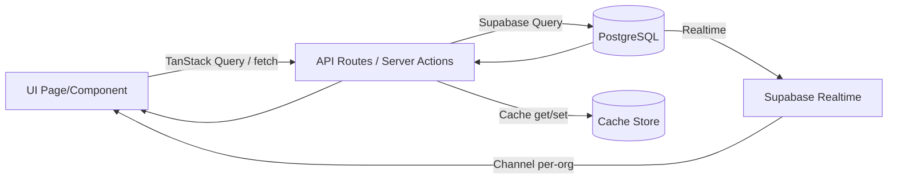

# WORKFLOW – Alur Kerja Proyek Presensi

Dokumen ini merangkum alur kerja end-to-end pada aplikasi Presensi: dari proses bootstrap di layout, resolusi multi-organisasi, pola fetch data + cache, realtime, hingga alur halaman utama seperti Dashboard dan Attendance List. Panduan ini juga memuat rekomendasi praktik performa dan keamanan, serta tata cara pengembangan dan deployment.

---

## 1) Arsitektur Singkat



- UI melakukan fetch ke API routes atau Server Actions.
- Server Actions mengakses Supabase (PostgreSQL) dan menyimpan hasil ke cache internal per organisasi dan filter.
- Supabase Realtime mengirim event ke klien untuk update instan tanpa polling (Observer API).

---

## 2) Bootstrap Aplikasi (Root Layout)

File: `src/app/layout.tsx`

- SSR: ambil user via `createClient()` server (`src/utils/supabase/server.ts`).
- Muat profil dan metadata via cache (`getCachedUserProfile`, `getCachedOrganizationTimezone`, `getCachedOrganizationName` → `src/lib/data-cache`).
- Providers yang diaktifkan:
  - `UserProvider`, `PermissionInitializer` (permissions), `TimezoneProvider`, `QueryProvider` (TanStack Query), `ThemeProvider`, `TimeFormatProvider`, `ToastProvider`, `OrganizationStatusChecker`, `AccountStatusChecker`.
- Hasil: setiap halaman dirender dengan konteks user, timezone, permissions, dan sistem notifikasi siap pakai.

---

## 3) Multi-Organization – Resolusi Organization ID

Sumber Organization ID (urut prioritas):

- **Klien**:
  - `useOrgStore()` (`src/store/org-store.ts`) → `organizationId` dipersist di `localStorage` (`org-store`).
  - `useHydration` (beberapa halaman) membantu memastikan nilai dari store sudah siap sebelum fetch.
- **Server Actions** (contoh: `getAllAttendance` di `src/action/attendance.ts`):
  - `organizationId` dari parameter fungsi.
  - Fallback cookie `org_id`.
  - Fallback membership user aktif (query ke `organization_members`).

Catatan penting:
- Saat berpindah organisasi, invalidasi semua query terkait organisasi untuk menghindari data stale (lihat bagian Cache & Invalidation).
- Hindari reliance ke cookie `org_id` di klien; selalu kirimkan `organizationId` sebagai query param atau argumen action.

---

## 4) Pola Fetch Data

### 4.1 Klien → Server Action

Contoh: `src/app/attendance/list/page.tsx` memanggil `getAllAttendance` dengan parameter lengkap.

```ts
const res = await getAllAttendance({
  page: currentPage,
  limit: itemsPerPage,
  dateFrom: toOrgYMD(dateRange.from, userTimezone),
  dateTo: toOrgYMD(dateRange.to, userTimezone),
  search: searchParam.length >= 2 ? searchParam : undefined,
  status: statusFilter === 'all' ? undefined : statusFilter,
  department: departmentFilter === 'all' ? undefined : departmentFilter,
  organizationId: orgId,
})
```

Prinsip:
- Selalu pass `organizationId`.
- Filter di-parameterkan, bukan hard-coded.
- Penanganan timezone di sisi klien konsisten (`toOrgYMD`, `formatLocalTime`).

### 4.2 Klien → API Routes

Contoh: `src/app/page.tsx` (Dashboard) memanggil:

```ts
await fetch(`/api/attendance-records?organizationId=${orgId}&limit=1000&t=${Date.now()}`)
```

Prinsip:
- Selalu kirim `organizationId` agar API tidak mengandalkan cookie lama.
- `t=${Date.now()}` opsional untuk bust cache browser.

### 4.3 Server Actions – Kontrak

Contoh: `src/action/attendance.ts#getAllAttendance()`:
- Terima parameter bertipe kuat (tanpa any): page, limit, dates, search, status, department, optional `organizationId`.
- Resolusi `effectiveOrgId`: param → cookie → membership user.
- Query efisien (join eksplisit, kolom minimal).
- Mapping hasil ke tipe `AttendanceListItem` yang konsisten untuk klien.
- Cache per-org+filter dan invalidasi pada perubahan data.

---

## 5) Cache & Invalidation

### 5.1 React Query (Klien)

- Saat `organizationId` berubah, invalidasi semua query terkait:

```ts
queryClient.invalidateQueries({ queryKey: ['organization'] })
queryClient.invalidateQueries({ queryKey: ['dashboard'] })
queryClient.invalidateQueries({ queryKey: ['stats'] })
queryClient.invalidateQueries({ queryKey: ['members'] })
queryClient.invalidateQueries({ queryKey: ['attendance'] })
queryClient.invalidateQueries({ queryKey: ['leaves'] })
queryClient.invalidateQueries({ queryKey: ['groups'] })
```

- Sesuaikan `staleTime`/`gcTime` untuk data yang sering berubah.

### 5.2 Cache Server Actions

- Key cache menyertakan `organizationId` dan semua filter penting.
- TTL moderat untuk keseimbangan performa vs kesegaran data.
- Invalidasi targeted menggunakan prefix per-org setelah `insert/update/delete`.

### 5.3 API Routes

- Gunakan header cache konsisten, mis. `Cache-Control: no-store` untuk data live.

---

## 6) Realtime (Observer API)

- Channel per organisasi untuk tabel kritikal. Contoh: `attendance_records:{orgId}`.
- Event: `INSERT`, `UPDATE`, `DELETE`.
- Strategi UI:
  - Jika endpoint by-id tersedia: lakukan incremental update.
  - Jika belum ada: fallback `full fetch` agar state valid.

Contoh callback (ketikkan payload dengan tipe Supabase):

```ts
import type { RealtimePostgresChangesPayload } from '@supabase/supabase-js'

type Row = { id: number }

.on(
  'postgres_changes',
  { event: '*', schema: 'public', table: 'attendance_records' },
  (payload: RealtimePostgresChangesPayload<{ new: Row; old: Row }>) => {
    if (payload.eventType === 'INSERT' || payload.eventType === 'UPDATE') {
      const id = String(payload.new?.id ?? '')
      if (id) fetchRef.current({ mode: 'single', id })
      else fetchRef.current({ mode: 'full' })
    } else if (payload.eventType === 'DELETE') {
      const id = String(payload.old?.id ?? '')
      if (id) removeFromState(id)
      else fetchRef.current({ mode: 'full' })
    }
  }
)
```

Contoh lain (finger registration): subscribe ke `device_commands` dan update UI on `EXECUTED`.

---

## 7) Alur Halaman Attendance List

File: `src/app/attendance/list/page.tsx`

- **State & Filter**: search (debounce), date range (`DateFilterBar`), status, department, pagination.
- **Fetch**: panggil `getAllAttendance({..., organizationId})`.
- **Timezone**: format tanggal/waktu dengan `formatLocalTime` dan param timezone hasil data.
- **Departments**: direkomputasi dari `attendanceData` untuk opsi filter.
- **UI**: skeleton loading, tabel desktop, pilihan bulk actions (future), `PaginationFooter`.
- **Realtime**: channel `attendance_records:{orgId}`
  - INSERT/UPDATE → coba incremental (rencana), bila belum tersedia → full fetch.
  - DELETE → hapus item di state jika id ada, else full fetch.

Catatan kualitas kode:
- Pastikan deklarasi `fetchRef` berada sebelum dipakai di efek realtime untuk menghindari lint `no-use-before-define`.
- Hindari penggunaan `any` untuk payload realtime.

---

## 8) Alur Halaman Dashboard

File: `src/app/page.tsx`

- **Hydration**: tunggu org-id siap (via store atau persisted state).
- **Fetch**: ke `/api/attendance-records?organizationId=...` (bukan cookie), kemudian filter di klien sesuai rentang tanggal.
- **Stats**: hitung `present/late/absent`, on-time rate, total/avg jam kerja; render charts (AreaChart, PieChart).
- **Invalidation**: saat org berubah, invalidasi query key terkait agar data selalu sesuai org aktif.

---

## 9) Pedoman Server Actions

- Terima `organizationId` (opsional) dan lakukan resolusi berurutan: param → cookie → membership user.
- Gunakan join eksplisit dan kolom minimal untuk efisiensi.
- Typed return (`GetAttendanceResult`, dsb.) untuk konsistensi di klien.
- Gunakan cache per org+filter; invalidasi targeted saat data berubah.

---

## 10) Pedoman API Routes

- Terima `organizationId` sebagai query param; jangan bergantung pada cookie untuk org aktif.
- `Cache-Control: no-store` untuk data live.
- Validasi input (Zod) dan parameterized queries.

---

## 11) Checklist Performa

- **Query**: minimal kolom, join eksplisit, pagination selalu aktif.
- **Cache**: key mengandung `organizationId` + filter; TTL seimbang; invalidasi prefix per org.
- **React Query**: query key menyertakan `organizationId`; invalidasi saat org berubah.
- **Realtime**: gunakan incremental update jika endpoint by-id tersedia; fallback full fetch bila perlu.
- **SSR**: render data yang stabil; hindari query berat di setiap request tanpa cache.
- **Interval**: matikan `refetchInterval` jika tidak kritis untuk mengurangi trafik.

---

## 12) Checklist Keamanan

- **Auth**: JWT via Supabase, RLS sesuai kebutuhan.
- **Secrets**: simpan di environment variables; jangan commit.
- **Input**: validasi Zod; hindari SQL injection (parameterized query).
- **Error**: tangani token invalid (clear cookies, redirect aman) di `src/utils/supabase/client.ts`.

---

## 13) Development Workflow

- Branching: `feature/...` → PR → Review → Merge.
- Menjalankan dev:

```bash
pnpm install
pnpm dev
```

- Lint & Test:

```bash
pnpm lint
pnpm test
```

- Tambah halaman baru:
  - Buat folder di `src/app/...` atau komponen di `src/components/...`.
  - Jika butuh data, tambahkan server action di `src/action/...` atau API route di `src/app/api/...`.
  - Pastikan menerima `organizationId` di data layer.

---

## 14) Deployment Workflow

- **Vercel** (rekomendasi): import repo, set env vars, deploy.
- **Docker**:

```bash
docker build -t presensi .
docker run -p 3000:3000 \
  -e NEXT_PUBLIC_SUPABASE_URL=xxx \
  -e NEXT_PUBLIC_SUPABASE_ANON_KEY=xxx \
  presensi
```

---

## 15) Troubleshooting Cepat

- **Data org salah/tertukar**: pastikan `organizationId` selalu dipass; invalidasi query saat org berubah.
- **Realtime tidak jalan**: cek channel name per-org dan `ALTER PUBLICATION supabase_realtime ADD TABLE ...`.
- **Hitungan total tidak sesuai**: cache COUNT mungkin stale; paksa invalidasi prefix cache.
- **Attendance single update belum efisien**: implement endpoint by-id di `/api/attendance-records?id=...` untuk incremental update.
- **Lint error `no-use-before-define`** di Attendance List: pindahkan deklarasi `fetchRef` sebelum efek realtime.

---

## 16) Referensi File Terkait

- `src/app/layout.tsx` – bootstrap providers dan SSR user/timezone/org name.
- `src/app/page.tsx` – Dashboard + invalidasi query saat org berubah.
- `src/app/attendance/list/page.tsx` – Attendance List (filter, pagination, realtime, fetch actions).
- `src/action/attendance.ts` – server action terstruktur (cache, efisiensi query, mapping hasil).
- `src/store/org-store.ts` – state organisasi terpersist.
- `src/utils/supabase/{client,server}.ts` – Supabase client SSR/CSR dan penanganan error token.

---

## 17) Lihat Juga

- `README.md` – ringkasan proyek.
- `docs/API_REFERENCE.md` – referensi API.
- `docs/DOCUMENTATION.md` – dokumentasi panjang (arsitektur, fitur lengkap).
- `docs/db-structure-attendance.md` – struktur database kehadiran.
- `docs/implementasi_old.md` – catatan implementasi versi sebelumnya.
